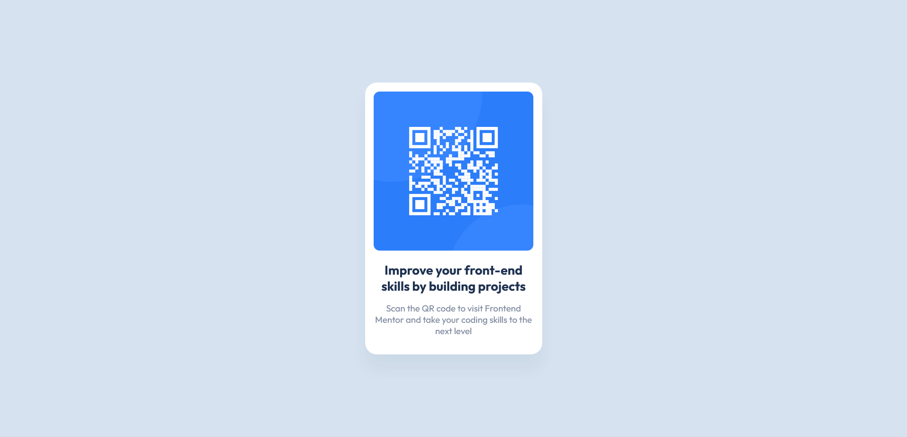

# Frontend Mentor - QR code component solution

Hellow fellas, this is a solution to the [QR code component challenge on Frontend Mentor](https://www.frontendmentor.io/challenges/qr-code-component-iux_sIO_H). "Frontend Mentor challenges help you improve your coding skills by building realistic projects". 

## Table of contents

- [Overview](#overview)
- [Screenshots](#screenshot)
- [Links](#links)
- [What I learned](#what-i-learned)
- [Useful resources](#useful-resources)
- [Author](#author)

## Overview

This is a basic card that shows a QR code, it has a breakpoint at 376 pixels min-width, css mobile first.

## Screenshots

Desktop version:



Mobile version:


## Links

- Solution URL: [GitHub Repository](https://github.com/joangute/mentor-solution_qr-code-component)
- Live Site URL: [GitHub Pages](https://joangute.github.io/mentor-solution_qr-code-component)


## What I learned

In this assignment Frontend Mentor gave us colors in hsl format. I had always used rgba() css function for box-shadow property, so I started converting the hsl format to rgb format, later I discovered that hsla() css function already existed and it was the one I finnaly used.

```css
/*First implementation, converting the hsl(218,44%,22%) color to rgb*/
.card{
box-shadow: 0px 25px 25px rgba(31,49,80,0.05);
}

/*the correct one*/
.card{
  box-shadow: 0px 25px 25px hsla(218,44%,22%,0.05);
}
```

## Useful resources

- [Type Scale](https://type-scale.com/) - This helped me get the H1 font size from my base font size of 15px.
- [Box-Sizing best practices](https://css-tricks.com/box-sizing/) - This is a good article which helped me implement box-sizing css property.


## Author

- Frontend Mentor - [@joangute](https://www.frontendmentor.io/profile/joangute)